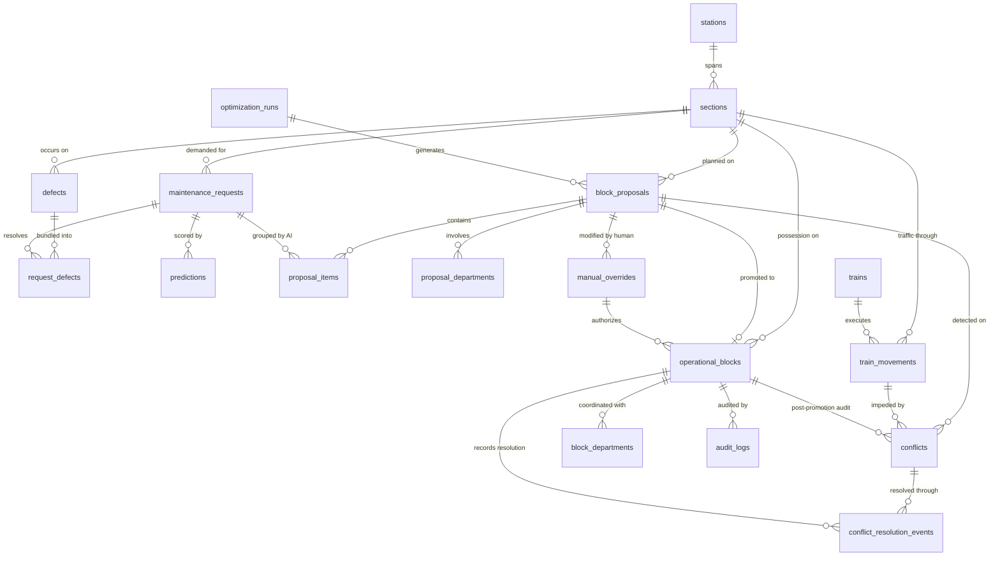

# RailNexus ABP — Phase 4: Persistence Architecture & Relational Schema Specification

**System:** RailNexus Automatic Block Planning (ABP) System
**Problem Statement:** Smart India Hackathon 2026 — PS 26027 (Ministry of Railways)
**Corridor:** Southern Railway (SR), Chennai Division (MAS), Arakkonam Junction (`AJJ`) to Jolarpettai Junction (`JTJ`) (8 sections, 144.5 km)
**Status:** Revised Architecture & Relational Schema Specification (Read-Only Architectural Blueprint; Zero Code or Database Changes)
**Previous Checkpoint:** `f0a3fb69 feat(domain): establish planning domain foundation`

---

## 1. Current Persistence Audit

An inspection of the live SQLite database (`railnexus.db`), SQLAlchemy ORM models ([backend/database/models/](file:///Users/ship/Desktop/SIH/railnexus/backend/database/models/)), repositories ([backend/repositories/](file:///Users/ship/Desktop/SIH/railnexus/backend/repositories/)), and services reveals the exact state of the existing persistence layer:

```
┌────────────────────────────────────────────────────────────────────────────────────────────────────────────────────────┐
│                                             LIVE SQLITE DATABASE AUDIT (railnexus.db)                                  │
├────────────────────────────┬───────┬─────────┬─────────┬────────┬───────────────────────────┬──────────────────────────┤
│ Table Name                 │ Rows  │ Columns │ FKs     │ Indexes│ Primary Key               │ Operational Status       │
├────────────────────────────┼───────┼─────────┼─────────┼────────┼───────────────────────────┼──────────────────────────┤
│ assets                     │ 0     │ 11      │ 0 (None)│ 3      │ id (VARCHAR(36))          │ DORMANT (Unpopulated)    │
│ maintenance_requests       │ 15    │ 12      │ 0 (None)│ 3      │ id (VARCHAR(80))          │ ACTIVE (Heavily loaded)  │
│ maintenance_history        │ 0     │ 7       │ 0 (None)│ 2      │ id (VARCHAR(36))          │ DEAD (Zero callers)      │
│ predictions                │ 14    │ 11      │ 0 (None)│ 1      │ id (VARCHAR(36))          │ ACTIVE (ML outputs)      │
│ trains                     │ 2     │ 6       │ 0 (None)│ 1      │ id (VARCHAR(36))          │ ACTIVE (Static timetable)│
│ tms_movements              │ 2     │ 7       │ 0 (None)│ 3      │ id (VARCHAR(36))          │ ACTIVE (Schedule delays) │
│ network_topology           │ 8     │ 13      │ 0 (None)│ 2      │ id (VARCHAR(36))          │ ACTIVE (Corridor sections)│
│ demo_integration_requests  │ 55    │ 12      │ 0 (None)│ 6      │ request_id (VARCHAR(36))  │ DEMO ONLY (Synthetic)    │
│ optimized_blocks           │ 1     │ 12      │ 0 (None)│ 2      │ id (VARCHAR(36))          │ ACTIVE (Destructive cache)│
└────────────────────────────┴───────┴─────────┴─────────┴────────┴───────────────────────────┴──────────────────────────┘
```

### Critical Database Deficiencies Discovered
1. **Zero Foreign Keys:** `PRAGMA foreign_key_list` returns empty arrays `[]` across all 9 tables. Relationships are tracked solely by unconstrained strings (e.g. `section_id = "AJJ-SHU"`, `maintenance_request_id = "DEMO-CHN-001"`). Referential integrity is entirely unenforced by the database engine.
2. **Missing Persistent Conflicts Table:** No `conflicts` table exists in `railnexus.db`. The API returns `conflicts: []` ([frontend/lib/api.ts#L230](file:///Users/ship/Desktop/SIH/railnexus/frontend/lib/api.ts#L230)), and all conflict detection/resolution interactions reside solely in volatile React component state.
3. **Destructive Optimization Overwrite:** In [optimized_block_repository.py#L37-L41](file:///Users/ship/Desktop/SIH/railnexus/backend/repositories/optimized_block_repository.py#L37-L41), every call to `save()` executes `db.delete(old)` on previous optimization results matching the hash of request IDs, erasing historical AI recommendations.
4. **Unattributed Override Dumps:** Operator overrides are saved via `POST /optimizer/overrides/{cache_id}` directly into a raw JSON column `operator_overrides: Mapped[dict] = mapped_column(JSON)` without tracking operator ID, designation, justification code, or timestamp.
5. **Dormant & Orphaned Models:**
   - `maintenance_history`: 0 rows; completely unreferenced in all backend routes and repositories.
   - `weather`: Defined in [backend/database/models/weather.py](file:///Users/ship/Desktop/SIH/railnexus/backend/database/models/weather.py) but not even created as a table in `railnexus.db`.
   - `assets`: 0 rows; never seeded or imported.
6. **Dual Data Shapes in JSON:** In [backend/services/maintenance_service.py#L43-L56](file:///Users/ship/Desktop/SIH/railnexus/backend/services/maintenance_service.py#L43-L56), the codebase must support both "nested" and "flat" dictionaries in `request_data` JSON because attributes were dumped without a typed relational schema.
7. **Conceptual Defect vs Work Request Conflation:** The prototype conflated physical infrastructure defects (e.g., USFD rail flaws, OHE droopers) with work requests (maintenance block applications submitted by field SSEs). As audited, all 15 records in `maintenance_requests` represent maintenance work applications (`work_type = "RAIL_REPLACEMENT"`, `"Track Maintenance"`), not raw defect sensor readings.

---

## 2. Current Data-Flow Map

Tracing data flow across the existing repository layers:

```
[ TMS / Field Patrol ] ──► POST /api/demo/seed OR POST /api/maintenance
                               │
                               ▼
                       [ MaintenanceCreate Schema ]
                               │
                               ▼
                       [ MaintenanceService ] (validates section string)
                               │
                               ▼
                       [ MaintenanceRepository.create() ]
                               │
                               ▼
            ┌──────────────────┴──────────────────┐
            ▼                                     ▼
 [ maintenance_requests table ]        [ POST /maintenance/{id}/predict ]
 (Status: 'pending', JSON blob)                   │
            │                                     ▼
            │                         [ PredictionService.predict() ]
            │                                     │
            │                                     ▼
            │                            [ predictions table ]
            │                         (failure risk, duration, delay)
            │                                     │
            └──────────────────┬──────────────────┘
                               │
                               ▼
                 [ POST /optimizer/optimize ]
                 (Filters ready requests via service.to_pipeline_request)
                               │
                               ▼
                     [ ModelPipeline.optimize() ]
                     (OR-Tools CP-SAT + Greedy Fallback)
                               │
                               ▼
                [ OptimizedBlockRepository.save() ]
                - Deletes existing rows with same hash: db.delete(old)
                - Dumps result dict into result_json
                               │
                               ▼
            ┌──────────────────┴──────────────────┐
            ▼                                     ▼
   [ GET /api/maintenance ]              [ GET /api/optimizer/optimize ]
   [ GET /api/predictions ]                        │
   [ GET /api/topology ]                           ▼
   [ GET /api/trains ]                   [ frontend/lib/dashboard-context.tsx ]
            │                            - optimizer state stored in React
            ▼                            - runs every 15s interval
   [ frontend/lib/api.ts ]               - conflicts: [] hardcoded
   (loadDashboardData)                             │
            │                                      ▼
            └──────────────────────────► [ UI Planning Board & Gantt Chart ]
```

---

## 3. Data Ownership Matrix

An analysis of data origins, mutability, and system roles across the existing codebase:

| Entity / Data Item | Origin System | Authoritative Owner | Mutability | Historical Preservation | Primary Operational Role |
| :--- | :--- | :--- | :--- | :--- | :--- |
| **Track Defect** (IMR/OBS) | TMS (P-Way USFD) | Engineering Dept | Immutable source | None in current DB | Raw maintenance input; triggers 72h safety replacement window |
| **OHE Defect** | TDMS | TRD Dept | Immutable source | None in current DB | Triggers 25 kV power isolation requirement |
| **Signalling Defect** | SMMS | S&T Dept | Immutable source | None in current DB | Triggers disconnection memo requirement |
| **Maintenance Request** | Field Supervisor (SSE) | Department SSE | Mutable status | Dead table (`maintenance_history`) | Work application demanding possession duration |
| **Train Timetable (Scheduled)** | COA | Operating Dept | Read-only static | Movement delay tracked | Scheduled passenger traffic constraints |
| **Goods-Train Forecast** | COA / Control Office | Chief Controller (CHC)| Dynamic forecast | Movement delay tracked | Freight traffic flow density constraints |
| **ML Prediction** | RailNexus Pipeline | RailNexus ML | Append-only / Versioned | Preserved per request ID | Advisory scoring (failure probability, duration, overrun) |
| **Block Proposal** | OR-Tools CP-SAT | RailNexus Optimizer | Append-only per Run | **DELETED on rerun (Defect)** | Advisory multi-department candidate grouping |
| **Candidate Conflict** | Collision Detector | RailNexus Engine | Append-only events | **Ephemeral (Not in DB)** | Pre-approval safety interlock on candidate proposals |
| **Operator Override** | Chief Controller (CHC) | Operating Dept | Append-only records | None (unversioned JSON) | Human-in-the-loop schedule modification |
| **Operational Block** | Section Controller | Operating Dept | Versioned revisions | None (mapped from request) | Final authoritative line possession grant |

---

## 4. Domain-to-Persistence Mapping

The Phase 3 domain layer (`backend/domain/`) established pure, decoupled domain models. In Phase 4, we define how these domain concepts map to normalized relational tables **without introducing ERP bloat**:

```
┌───────────────────────────────────────┬──────────────────────────────────────────┬────────────────────────────────────────────────────────┐
│ Domain Concept (Phase 3)              │ Target Relational Entity (Phase 4)       │ Architectural Justification under SIH26027             │
├───────────────────────────────────────┼──────────────────────────────────────────┼────────────────────────────────────────────────────────┤
│ KmRange(start_km, end_km)             │ start_km NUMERIC, end_km NUMERIC         │ Enforces spatial continuity along track line           │
│ TimeWindow(start_time, end_time)      │ start_time TIMESTAMPTZ, end_time TIMESTAMPTZ│ Enforces temporal window sanity (start < end)        │
│ MaintenanceRequest                    │ maintenance_requests                     │ Department work orders submitted by SSEs               │
│ Category (IMR, OBS, PM)               │ defects.category (VARCHAR / ENUM)        │ Preserves USFD defect classification and urgency       │
│ Conflict                              │ conflicts                                │ Persists operational collisions across candidate items │
│ ConflictResolutionEvent               │ conflict_resolution_events               │ Preserves multi-event resolution negotiation history   │
│ ManualOverride                        │ manual_overrides                         │ Preserves human controller adjustments and reasons     │
│ OperationalBlock                      │ operational_blocks                       │ Authoritative line block possession grant orders       │
│ OptimizationRun                       │ optimization_runs                        │ Captures CP-SAT batch provenance, algorithm & horizon  │
│ BlockProposal                         │ block_proposals                          │ AI-generated grouping proposals before human decision  │
│ ProposalDepartment                    │ proposal_departments                     │ Relational multi-department participation on proposals │
│ BlockDepartment                       │ block_departments                        │ Relational multi-department participation & permits    │
│ Prediction                            │ predictions                              │ Persists ML failure risk, duration, and delay scores   │
│ GoodsTrainForecast                    │ train_movements (movement_type = GOODS)  │ Provides traffic constraints for corridor freight      │
└───────────────────────────────────────┴──────────────────────────────────────────┴────────────────────────────────────────────────────────┘
```

### Entity Inclusion Justification (Zero-Bloat Guarantee)

Every proposed table strictly satisfies SIH26027:
1. **`stations` & `sections`:** Required for spatial topology validation. Without them, kilometer markers cannot be verified against the physical corridor, and the time-distance chart cannot render.
2. **`defects`:** Required to integrate TMS, SMMS, and TDMS inspection feeds. Without this, IMR/OBS 72-hour safety replacement windows cannot be tracked from source data.
3. **`maintenance_requests`:** Required for departmental work orders. A single request coordinates work on a section and may bundle multiple minor defects.
4. **`request_defects`:** Required to map physical defects to the maintenance work applications that address them.
5. **`predictions`:** Required to persist XGBoost ML model predictions (failure probability, predicted duration, overrun risk, train delay) across model runs and training versions.
6. **`trains` & `train_movements`:** Required to represent COA train paths and Control Office goods-train forecasts. Without this, block possessions would be scheduled blind to traffic, causing severe passenger/freight delays.
7. **`optimization_runs` & `block_proposals`:** Required to persist AI/ML recommendations and CP-SAT grouping outputs without destroying past history.
8. **`proposal_items` & `proposal_departments`:** Required to represent multi-department work bundling on candidate block proposals prior to approval.
9. **`conflicts` & `conflict_resolution_events`:** Required to detect spatial-temporal collisions on candidate proposals before approval and preserve resolution history.
10. **`manual_overrides`:** Required to ensure human operators retain final authority over AI suggestions while maintaining an auditable record of deliberation events.
11. **`operational_blocks` & `block_departments`:** Required to store the final granted possession schedule and track departmental permits (TRD power, S&T disconnection).
12. **`audit_logs`:** Required for application auditability and reconstructing planning and approval decisions.

*Excluded as bloat:* Payroll, ticketing, passenger manifests, locomotive roster management, material procurement, station commercial leases, and signalling interlocking circuit simulation.

---

## 5. Conflict Persistence Design & Pre-Approval Planning Lifecycle

### Canonical Planning & Conflict Flow
In railway operations, **conflicts must be detected and resolved before an operational block is granted**. A conflict represents a collision between candidate block proposals and scheduled/forecast train traffic, or between two competing departmental proposals on the same section.

The canonical planning lifecycle is strictly:

```
                  ┌────────────────────────┐
                  │    Optimization Run    │
                  └───────────┬────────────┘
                              │
                              ▼
                  ┌────────────────────────┐
                  │     Block Proposal     │
                  └───────────┬────────────┘
                              │
                              ▼
                  ┌────────────────────────┐
                  │   Conflict Detection   │
                  └───────────┬────────────┘
                              │
                              ▼
                  ┌────────────────────────┐
                  │  Conflict Resolution   │
                  └───────────┬────────────┘
                              │
                              ▼
                  ┌────────────────────────┐
                  │  Human Review/Override │
                  └───────────┬────────────┘
                              │
                              ▼
                  ┌────────────────────────┐
                  │   Operational Block    │
                  └────────────────────────┘
```

### Minimum Conflict Model Determination
We evaluate what entities a conflict must reference:
1. **`block_proposals`:** The primary candidate planning entity. A block proposal represents a requested corridor possession window $[T_{start}, T_{end}]$ over a spatial section. Any collision with traffic or another work proposal occurs at the proposal window level.
2. **`proposal_items` vs `block_proposals`:** An individual proposal item is a single maintenance request bundled inside a block proposal. If a train path overlaps with a proposed block window, the conflict affects the entire block proposal. Referencing `proposal_items` would multiply conflict rows redundantly without altering the operational decision. Thus, referencing `block_proposals` is the **minimum model necessary**.
3. **`train_movements`:** Represents both scheduled passenger trains and forecast goods traffic moving through the corridor section. When a candidate block proposal overlaps with a train movement window, the conflict references `train_movement_id`.
4. **Competing Block Proposals:** When two candidate proposals from different runs or overlapping requests contend for the same track line, the conflict references `proposal_a_id` and `proposal_b_id`.

### Post-Promotion Association
When a block proposal is approved and promoted to an `operational_blocks` record:
- The conflict record maintains its link to the original proposal (`proposal_a_id`).
- The conflict record explicitly sets `resulting_block_id = operational_blocks.id`.
- The operational block also points back to `origin_proposal_id = block_proposals.id`.
- This ensures full traceability: an auditor or controller can inspect an operational block and immediately see all pre-approval conflicts that were resolved to grant it.

### Safety Invariant
The persistence architecture enforces the invariant:
> **"A block proposal with an unresolved blocking conflict cannot be promoted to an approved operational block."**

At the database and domain level:
$$\text{COUNT}(\text{conflicts WHERE proposal\_a\_id} = P \land \text{status} = \text{'UNRESOLVED'} \land \text{is\_blocking} = \text{TRUE}) = 0$$
Any transaction attempting to create an `operational_blocks` row with `status = 'APPROVED'` referencing proposal $P$ while this count is non-zero will be rejected by the domain service and database trigger/constraint.

---

## 6. Conflict Resolution Cardinality & Multi-Event History

### Evaluation of 1:1 vs 1:N Resolution Models
In the prototype, conflict resolution was modeled as a simple 1:1 update or ephemeral state change. We evaluate whether resolution history requires multiple resolution events:

- **1 : 1 Model (Rejected):** A single resolution record or in-table resolution status.
  - *Deficiency:* If an initial resolution proposal (e.g., Section Controller proposes shifting block by 30 minutes) is rejected by the Chief Controller due to freight priority, and a second resolution (rerouting a goods train) is enacted, the first resolution attempt, its justification, and its rejection reason are permanently destroyed.
- **1 : N Model (`conflict_resolution_events`) (Selected):**
  $$\text{Conflict} \xrightarrow{1:N} \text{Resolution Event 1} \rightarrow \text{Resolution Event 2} \rightarrow \dots \rightarrow \text{Current Active Resolution}$$
  - *Benefits:*
    1. Preserves complete deliberation history across control shifts (e.g. shift handover between morning and evening controllers).
    2. Allows controllers to see why an earlier resolution failed or was superseded.
    3. Fulfills the application auditability requirement for reconstructing planning and approval decisions.

### Minimal Structure for `conflict_resolution_events`
To avoid overengineering, the resolution event table contains only the operational essentials:
- `id UUID PRIMARY KEY DEFAULT gen_random_uuid()`
- `conflict_id VARCHAR(50) NOT NULL REFERENCES conflicts(id) ON DELETE CASCADE`
- `event_sequence INTEGER NOT NULL DEFAULT 1`
- `resolution_action VARCHAR(30) NOT NULL` (`'MERGED'`, `'SEQUENCED'`, `'REROUTED'`, `'SHIFTED_WINDOW'`, `'CANCELLED_REQUEST'`, `'ESCALATED'`)
- `actor_id VARCHAR(50) NOT NULL` (e.g. `'CHC-MAS-01'`)
- `actor_role VARCHAR(50) NOT NULL` (e.g. `'Chief Controller'`)
- `resulting_block_id VARCHAR(50) NULL REFERENCES operational_blocks(id) ON DELETE SET NULL`
- `rationale_notes TEXT NOT NULL` (Mandatory explanation)
- `is_current_resolution BOOLEAN NOT NULL DEFAULT TRUE`
- `created_at TIMESTAMPTZ NOT NULL DEFAULT NOW()`

A partial unique index enforces that only one event per conflict is marked active:
```sql
CREATE UNIQUE INDEX uq_conflict_current_resolution
ON conflict_resolution_events (conflict_id)
WHERE is_current_resolution = TRUE;
```

---

## 7. AI/ML Persistence Model (Predictions, Runs, and Proposals)

RailNexus must be able to answer: *"Why did the system recommend this block?"* and *"What were the ML predictions for this maintenance item at the time of scheduling?"*

### Existing AI Pipeline Output Preservation
An audit of `ai_ml/pipeline.py`, `backend/services/prediction_service.py`, and `backend/database/models/prediction.py` reveals the exact feature set generated by the active XGBoost pipeline:
1. `failure_risk_probability` (Float): Probability of asset failure if unmaintained.
2. `priority_score` (Float): Derived composite priority score (0-100).
3. `urgency_level` (String): Categorical classification (`'critical'`, `'high'`, `'medium'`, `'low'`).
4. `predicted_duration_minutes` (Float): Regression output for required work duration.
5. `overrun_probability` (Float): Probability that maintenance will exceed demanded duration.
6. `trains_affected` (Float): Number of train paths impacted.
7. `total_delay_minutes` (Float): Total estimated passenger and freight delay minutes.
8. `raw_output` (JSON): Verbatim output returned by `ModelPipeline.score_request()`.

### Current vs Historical Predictions Determination
- Predictions are **both current + historical**.
- The `predictions` table is strictly append-only.
- When an asset's inspection data is updated or re-evaluated, a new prediction record is inserted.
- The latest active prediction is marked with `is_current = TRUE`, while prior scores are flipped to `is_current = FALSE`.
- A composite index `(maintenance_request_id, is_current)` allows instant retrieval of the active prediction for optimization, while keeping the full historical lineage intact for retrospective model performance evaluation.

```sql
CREATE TABLE predictions (
    id VARCHAR(36) PRIMARY KEY,
    maintenance_request_id VARCHAR(80) NOT NULL REFERENCES maintenance_requests(id) ON DELETE CASCADE,
    prediction_timestamp TIMESTAMPTZ NOT NULL DEFAULT NOW(),
    model_version VARCHAR(50) NOT NULL DEFAULT 'xgboost_pipeline_v1.0',
    failure_risk_probability FLOAT NOT NULL,
    priority_score FLOAT NOT NULL,
    urgency_level VARCHAR(20) NOT NULL,
    predicted_duration_minutes FLOAT NOT NULL,
    overrun_probability FLOAT NOT NULL,
    trains_affected FLOAT NOT NULL DEFAULT 0.0,
    total_delay_minutes FLOAT NOT NULL DEFAULT 0.0,
    raw_output JSONB NOT NULL DEFAULT '{}',
    feature_snapshot_json JSONB NOT NULL DEFAULT '{}',
    is_current BOOLEAN NOT NULL DEFAULT TRUE,
    created_at TIMESTAMPTZ NOT NULL DEFAULT NOW()
);
CREATE UNIQUE INDEX uq_current_request_prediction
ON predictions (maintenance_request_id)
WHERE is_current = TRUE;
```

---

## 8. Multi-Department Model (Engineering, TRD, S&T)

### Department Participation Across the Lifecycle
A critical SIH26027 mandate is coordinated multi-department block planning. The three core technical railway departments are:
1. **Engineering (P.Way):** Permanent Way track maintenance, rail renewal, tamping, deep screening.
2. **TRD (Traction Distribution):** Overhead Equipment (OHE) 25 kV AC maintenance, contact wire height/stagger adjustment, power isolation.
3. **S&T (Signalling & Telecommunications):** Point machine overhaul, track circuit testing, axel counter maintenance, signal disconnection.

### Relational Association Determination
Department participation exists in two distinct operational phases and must be modeled on **both**:
- **On `block_proposals` (`proposal_departments`):** In the planning phase, the CP-SAT optimizer bundles activities across departments. The proposal must record which departments are bundled, their individual work descriptions, individual demanded durations, and their safety prerequisites (e.g., whether TRD requires 25 kV de-energization, whether S&T requires disconnection).
- **On `operational_blocks` (`block_departments`):** In the execution phase, each participating department must coordinate field execution. The operational block records departmental permit status (`PENDING`, `PERMIT_ISSUED`, `WORK_IN_PROGRESS`, `CLEARED`), Senior Section Engineer (SSE) in charge, and clearance timestamps.

This replaces the unindexed `TEXT[]` array with normalized relational association tables:

```sql
CREATE TABLE proposal_departments (
    proposal_id UUID NOT NULL REFERENCES block_proposals(id) ON DELETE CASCADE,
    department VARCHAR(20) NOT NULL,           -- 'ENGG', 'TRD', 'SNT'
    work_description TEXT NULL,
    demanded_duration_minutes INTEGER NULL,
    requires_power_isolation BOOLEAN NOT NULL DEFAULT FALSE,
    requires_disconnection BOOLEAN NOT NULL DEFAULT FALSE,
    PRIMARY KEY (proposal_id, department)
);

CREATE TABLE block_departments (
    block_id VARCHAR(50) NOT NULL REFERENCES operational_blocks(id) ON DELETE CASCADE,
    department VARCHAR(20) NOT NULL,           -- 'ENGG', 'TRD', 'SNT'
    sse_in_charge VARCHAR(50) NULL,
    permit_status VARCHAR(30) NOT NULL DEFAULT 'PENDING', -- 'PENDING', 'PERMIT_ISSUED', 'WORK_IN_PROGRESS', 'CLEARED'
    permit_issued_at TIMESTAMPTZ NULL,
    cleared_at TIMESTAMPTZ NULL,
    clearance_notes TEXT NULL,
    PRIMARY KEY (block_id, department)
);
```

---

## 9. Goods-Train Forecast Representation

### Contrast: Scheduled Passenger vs Goods Traffic
SIH26027 explicitly requires: *"goods trains forecast from the Control Office"*.
- **Passenger Traffic (Timetabled):** Governed by the Working Time Table (WTT) published in COA. Trains have fixed numbers (e.g. 12005 Shatabdi Express), fixed path timings, and strict punctuality metrics.
- **Goods Traffic (Freight Forecast):** Goods trains do NOT run to a published public timetable. The Control Office (via Chief Controller / Freight Controller) issues rolling operational forecasts based on rake readiness, yard departures, and loading points (e.g., coal rakes from Chennai Port, container rakes from CONCOR siding).

### Classification of Mandate vs Implementation Parameters
To preserve rigorous domain governance (per `docs/domain-assumptions.md` `DA-006`):
1. **Core Integration Mandate (VERIFIED):** Integrating dynamic goods-train forecasts from the Control Office into maintenance block planning is an explicit, verified SIH26027 requirement.
2. **Confidence Weights (CONFIGURABLE POLICY):** The specific default confidence weight (e.g. 0.80 for freight vs 1.0 for passenger) is a configurable policy parameter (`DomainPolicyConfig.goods_forecast_default_confidence = 0.80`), not an IR statutory standard or SIH-mandated constant.
3. **Forecast Horizon (INFERRED):** An 8-hour to 24-hour forecast window is an inferred operational design matching standard Indian Railways divisional shift ordering cycles.
4. **Penalty Formula (INFERRED):** The delay penalty formula ($\text{delay} \times \text{confidence} \times \text{priority}$) is an inferred implementation heuristic for the CP-SAT optimizer objective function.
5. **Tonnage & Commodity (OPTIONAL / INFERRED):** Gross tonnage (`expected_tonnage_mgt`) and commodity/rake type are optional metadata fields for future track degradation modeling, not mandatory SIH inputs.

### Minimum Persistence Representation
We avoid building an unnecessary freight management or locomotive roster system. The model only provides the CP-SAT optimizer with corridor traffic constraints relevant to maintenance block planning:

```sql
CREATE TABLE train_movements (
    id VARCHAR(36) PRIMARY KEY,
    train_id VARCHAR(36) NOT NULL REFERENCES trains(id) ON DELETE CASCADE,
    section_id VARCHAR(50) NOT NULL REFERENCES sections(id),
    movement_type VARCHAR(30) NOT NULL DEFAULT 'SCHEDULED', -- 'SCHEDULED', 'GOODS_FORECAST'
    traffic_source VARCHAR(30) NOT NULL DEFAULT 'COA_TIMETABLE', -- 'COA_TIMETABLE', 'CONTROL_OFFICE_FORECAST'
    movement_date DATE NOT NULL,
    scheduled_minute INTEGER NOT NULL,
    actual_minute INTEGER NULL,
    delay_minutes NUMERIC(6, 2) NOT NULL DEFAULT 0.0,
    forecast_window_start TIMESTAMPTZ NULL,    -- Estimated section arrival
    forecast_window_end TIMESTAMPTZ NULL,      -- Estimated section departure
    expected_tonnage_mgt NUMERIC(8, 2) NULL,   -- Optional: freight gross tonnage
    confidence_weight NUMERIC(3, 2) NOT NULL DEFAULT 1.0, -- Configurable: 1.0 for passenger, ~0.80 for forecast
    commodity_or_rake_type VARCHAR(50) NULL,   -- Optional: e.g. 'BOXN_COAL', 'CONTAINER'
    created_at TIMESTAMPTZ NOT NULL DEFAULT NOW()
);
```

### Optimizer Constraint Integration
The CP-SAT optimizer consumes `train_movements`:
- If `movement_type = 'SCHEDULED'`: Hard or high-penalty constraint preventing block overlap with passenger paths.
- If `movement_type = 'GOODS_FORECAST'`: Penalty cost proportional to $\text{delay\_minutes} \times \text{confidence\_weight} \times \text{priority\_tier}$.
This allows the optimizer to schedule maintenance blocks into natural gaps between forecast freight movements without violating passenger punctuality.

---

## 10. Corrected Defect $\rightarrow$ Maintenance Request Migration

### Domain Distinction
- **Defect:** A physical flaw or degradation in railway infrastructure (e.g., an ultrasonic rail flaw detected by a USFD trolley, a cracked fishplate, a loose OHE dropper, or a track circuit fail). Originates in TMS, SMMS, or TDMS.
- **Maintenance Request:** A work application submitted by an SSE (Senior Section Engineer) demanding track possession time, personnel, and machine resources to execute maintenance work.

### Live Codebase Inspection Findings
Inspection of the 15 records in `railnexus.db` confirms:
- Every existing row in `maintenance_requests` represents a **maintenance work application** (`work_type = "RAIL_REPLACEMENT"`, `"Track Maintenance"`), not a raw flaw detection record.
- Synthetically manufacturing defect records merely to populate a new `defects` table would introduce false telemetry into the database.

### Corrected Migration Strategy
1. **Preserve Existing Maintenance Requests:** All 15 existing records in `maintenance_requests` are migrated directly into the target `maintenance_requests` table, retaining their primary keys (`id`), sections, departments, demanded durations, and statuses.
2. **Clean Defect Table:** The `defects` table is initialized with the proper schema to receive future real-time feeds from TMS, SMMS, and TDMS.
3. **No Fabricated Defects:** No defect records are manufactured for the 15 legacy work requests. The join table `request_defects` remains empty for these legacy requests.
4. **Handling Source Ambiguity:** If legacy `request_data` JSON contains unvalidated attributes (such as `asset_type: "TRACK_CIRCUIT"` or generic `asset_id`), these are preserved verbatim in `maintenance_requests.request_data_raw` and `equipment_ids`, rather than guessing or fabricating a defect record.

---

## 11. Asset Availability Model: Persisted Entities vs Derived Analytic Metrics

### SIH26027 Objective
The central objective of SIH26027 is **maximizing asset availability for train operations**. To maintain architectural rigor without introducing non-existent tables or invented telemetry, we explicitly separate **directly persisted database entities** from **derived operational analytics**.

### 1. Directly Persisted Entities & Columns
The relational persistence layer strictly stores the physical and operational facts of the corridor:

| Entity / Table | Persisted Columns | Operational Meaning |
| :--- | :--- | :--- |
| **`sections`** | `id`, `start_km`, `end_km`, `distance_km`, `mps_kmh` | The physical corridor track block section (primary infrastructure asset unit). |
| **`maintenance_requests`** | `demanded_duration_minutes`, `work_type`, `location_km` | Demanded possession duration and work scope requested by SSEs. |
| **`block_proposals`** | `proposed_start_time`, `proposed_end_time`, `possession_saving_minutes`, `train_impact_minutes` | AI-recommended block window and estimated possession savings. |
| **`operational_blocks`** | `scheduled_start`, `scheduled_end`, `actual_start`, `actual_end` | Approved line closure window and recorded field execution reality. |
| **`defects`** | `speed_restriction_kmh` | Active temporary speed restriction (TSR) imposed due to an infrastructure flaw (e.g. 30 km/h on IMR). |
| **`predictions`** | `trains_affected`, `total_delay_minutes` | ML pipeline output estimating train delays resulting from maintenance deferral or execution. |

### 2. Derived Operational & Analytic Metrics
The following metrics are **NOT stored as database columns**. They are dynamically computed in reporting views, dashboard endpoints, and analytics queries:

1. **Asset Availability Index (AAI) / Section Availability %:**
   $$\text{Section Availability \%} = \frac{\text{Section Total Operating Minutes} - \text{Total Unavailable Minutes}}{\text{Section Total Operating Minutes}} \times 100\%$$
   Where:
   - Baseline capacity: $24 \times 60 = 1,440\text{ minutes/day}$ per track line.
   - Total unavailable minutes: $\sum (\text{operational\_blocks.scheduled\_end} - \text{scheduled\_start}) + \text{execution overruns}$.
2. **Cumulative Downtime Saved (Coordination Efficiency):**
   $$\text{Downtime Saved} = \sum (\text{Individual Demanded Durations}) - \text{Coordinated Possession Window}$$
   Aggregated across `optimization_runs.total_possession_saving_minutes` to report how multi-department shadow-block bundling prevents fragmented track closures.
3. **Corridor Capacity Utilization %:**
   $$\text{Utilization \%} = \frac{\text{Sum of Train Movement Slot Minutes} + \text{Maintenance Block Minutes}}{\text{Total Available Section Minutes}} \times 100\%$$

### 3. Boundary & Future Telemetry for Temporary Speed Restriction (TSR) Loss
While `defects.speed_restriction_kmh` records that a 30 km/h TSR exists on a section, the *exact train throughput minutes lost to deceleration and acceleration* is a **derived analytic metric**, not a persisted database column.

In the current prototype, precise physical TSR loss cannot be calculated dynamically from persisted fields alone because:
- Locomotive trailing load tonnages and tractive effort curves are not modeled.
- Train braking deceleration curves and acceleration recovery characteristics are not present.
- Section gradient and curvature profiles are not stored in `railnexus.db`.

Therefore, the current system relies on the heuristic train delay estimated by the ML pipeline (`predictions.total_delay_minutes`). Detailed physical TSR train-delay calculation is explicitly designated as an **inferred analytic enhancement** requiring future locomotive/track geometry telemetry streams.

---

## 12. Target Logical Schema

```sql
-- ====================================================================
-- 1. INFRASTRUCTURE TOPOLOGY
-- ====================================================================
CREATE TABLE stations (
    code VARCHAR(10) PRIMARY KEY,              -- 'AJJ', 'KPD', 'JTJ'
    name VARCHAR(100) NOT NULL,
    division VARCHAR(50) NOT NULL DEFAULT 'MAS',
    zone VARCHAR(10) NOT NULL DEFAULT 'SR',
    km_location NUMERIC(7, 3) NOT NULL,
    created_at TIMESTAMPTZ NOT NULL DEFAULT NOW()
);

CREATE TABLE sections (
    id VARCHAR(50) PRIMARY KEY,                -- 'AJJ-SHU'
    division VARCHAR(50) NOT NULL DEFAULT 'MAS',
    start_station_code VARCHAR(10) NOT NULL REFERENCES stations(code),
    end_station_code VARCHAR(10) NOT NULL REFERENCES stations(code),
    start_km NUMERIC(7, 3) NOT NULL,
    end_km NUMERIC(7, 3) NOT NULL,
    distance_km NUMERIC(7, 3) NOT NULL,
    track_count INTEGER NOT NULL DEFAULT 2,
    mps_kmh NUMERIC(5, 2) NOT NULL DEFAULT 130.0,
    created_at TIMESTAMPTZ NOT NULL DEFAULT NOW(),
    CONSTRAINT chk_section_km CHECK (end_km >= start_km)
);

-- ====================================================================
-- 2. SOURCE DEFECTS & MAINTENANCE WORK REQUESTS
-- ====================================================================
CREATE TABLE defects (
    id VARCHAR(50) PRIMARY KEY,                -- 'DEF-2026-001'
    source_system VARCHAR(30) NOT NULL,        -- 'TMS', 'SMMS', 'TDMS', 'MANUAL'
    external_source_id VARCHAR(100) NOT NULL,  -- Unique ID in CRIS system
    section_id VARCHAR(50) NOT NULL REFERENCES sections(id),
    department VARCHAR(20) NOT NULL,           -- 'ENGG', 'TRD', 'SNT'
    category VARCHAR(20) NOT NULL,             -- 'IMR', 'OBS', 'PM'
    location_km NUMERIC(7, 3) NOT NULL,
    track_line VARCHAR(10) NOT NULL DEFAULT 'UP',
    speed_restriction_kmh INTEGER NULL,       -- E.g. 30 km/h for IMR
    safety_deadline TIMESTAMPTZ NULL,          -- 72h safety replacement window
    status VARCHAR(30) NOT NULL DEFAULT 'OPEN',-- 'OPEN', 'SCHEDULED', 'ATTENDED', 'CLOSED'
    created_at TIMESTAMPTZ NOT NULL DEFAULT NOW(),
    CONSTRAINT uq_defect_source UNIQUE (source_system, external_source_id)
);

CREATE TABLE maintenance_requests (
    id VARCHAR(80) PRIMARY KEY,                -- 'REQ-1947' or 'DEMO-5ACDC95CA49E'
    section_id VARCHAR(50) NOT NULL REFERENCES sections(id),
    department VARCHAR(20) NOT NULL,           -- 'ENGG', 'TRD', 'SNT'
    work_type VARCHAR(100) NOT NULL,           -- 'RAIL_REPLACEMENT', 'OHE_INSPECTION'
    location_km NUMERIC(7, 3) NOT NULL,
    track_line VARCHAR(10) NOT NULL DEFAULT 'UP',
    demanded_duration_minutes INTEGER NOT NULL,
    safety_critical BOOLEAN NOT NULL DEFAULT FALSE,
    requires_power_isolation BOOLEAN NOT NULL DEFAULT FALSE,
    requires_disconnection BOOLEAN NOT NULL DEFAULT FALSE,
    equipment_ids TEXT[] NOT NULL DEFAULT '{}',
    deadline_minutes INTEGER NULL,
    priority VARCHAR(20) NOT NULL DEFAULT 'MEDIUM',
    status VARCHAR(30) NOT NULL DEFAULT 'SUBMITTED', -- 'SUBMITTED', 'READY_FOR_OPTIMIZATION', 'PROPOSED', 'APPROVED'
    request_data_raw JSONB NOT NULL DEFAULT '{}',
    created_at TIMESTAMPTZ NOT NULL DEFAULT NOW()
);

CREATE TABLE request_defects (
    maintenance_request_id VARCHAR(80) NOT NULL REFERENCES maintenance_requests(id) ON DELETE CASCADE,
    defect_id VARCHAR(50) NOT NULL REFERENCES defects(id) ON DELETE RESTRICT,
    PRIMARY KEY (maintenance_request_id, defect_id)
);

-- ====================================================================
-- 3. AI PREDICTIONS
-- ====================================================================
CREATE TABLE predictions (
    id VARCHAR(36) PRIMARY KEY,
    maintenance_request_id VARCHAR(80) NOT NULL REFERENCES maintenance_requests(id) ON DELETE CASCADE,
    prediction_timestamp TIMESTAMPTZ NOT NULL DEFAULT NOW(),
    model_version VARCHAR(50) NOT NULL DEFAULT 'xgboost_pipeline_v1.0',
    failure_risk_probability FLOAT NOT NULL,
    priority_score FLOAT NOT NULL,
    urgency_level VARCHAR(20) NOT NULL,        -- 'critical', 'high', 'medium', 'low'
    predicted_duration_minutes FLOAT NOT NULL,
    overrun_probability FLOAT NOT NULL,
    trains_affected FLOAT NOT NULL DEFAULT 0.0,
    total_delay_minutes FLOAT NOT NULL DEFAULT 0.0,
    raw_output JSONB NOT NULL DEFAULT '{}',
    feature_snapshot_json JSONB NOT NULL DEFAULT '{}',
    is_current BOOLEAN NOT NULL DEFAULT TRUE,
    created_at TIMESTAMPTZ NOT NULL DEFAULT NOW()
);
CREATE UNIQUE INDEX uq_current_request_prediction
ON predictions (maintenance_request_id)
WHERE is_current = TRUE;

-- ====================================================================
-- 4. AI OPTIMIZATION & CANDIDATE BLOCK PROPOSALS
-- ====================================================================
CREATE TABLE optimization_runs (
    id UUID PRIMARY KEY DEFAULT gen_random_uuid(),
    planning_horizon VARCHAR(20) NOT NULL DEFAULT 'WEEKLY', -- 'WEEKLY', 'MONTHLY', 'AD_HOC'
    planning_cycle_label VARCHAR(50) NOT NULL, -- '2026-W39', '2026-M10'
    effective_date_start DATE NOT NULL,
    effective_date_end DATE NOT NULL,
    corridor_id VARCHAR(50) NOT NULL DEFAULT 'AJJ-JTJ',
    input_requests_hash VARCHAR(64) NOT NULL,
    input_snapshot_json JSONB NOT NULL,
    algorithm_version VARCHAR(50) NOT NULL DEFAULT 'cp_sat_v2.1',
    weights_json JSONB NOT NULL,
    solver_status VARCHAR(30) NOT NULL,        -- 'OPTIMAL', 'FEASIBLE', 'FALLBACK'
    solver_duration_ms INTEGER NOT NULL DEFAULT 0,
    total_possession_saving_minutes NUMERIC(8, 2) NOT NULL DEFAULT 0.0,
    total_train_impact_minutes NUMERIC(8, 2) NOT NULL DEFAULT 0.0,
    created_at TIMESTAMPTZ NOT NULL DEFAULT NOW()
);

CREATE TABLE block_proposals (
    id UUID PRIMARY KEY DEFAULT gen_random_uuid(),
    run_id UUID NOT NULL REFERENCES optimization_runs(id) ON DELETE CASCADE,
    section_id VARCHAR(50) NOT NULL REFERENCES sections(id),
    proposed_start_time TIMESTAMPTZ NOT NULL,
    proposed_end_time TIMESTAMPTZ NOT NULL,
    predicted_duration_minutes NUMERIC(6, 2) NOT NULL,
    possession_saving_minutes NUMERIC(6, 2) NOT NULL,
    train_impact_minutes NUMERIC(6, 2) NOT NULL,
    trains_affected_count INTEGER NOT NULL DEFAULT 0,
    confidence_score NUMERIC(5, 2) NOT NULL,
    top_factors_json JSONB NOT NULL DEFAULT '{}',
    safety_cautions TEXT[] NOT NULL DEFAULT '{}',
    status VARCHAR(30) NOT NULL DEFAULT 'PROPOSED', -- 'PROPOSED', 'ACCEPTED', 'OVERRIDDEN', 'REJECTED'
    created_at TIMESTAMPTZ NOT NULL DEFAULT NOW(),
    CONSTRAINT chk_proposal_window CHECK (proposed_end_time > proposed_start_time)
);

CREATE TABLE proposal_items (
    proposal_id UUID NOT NULL REFERENCES block_proposals(id) ON DELETE CASCADE,
    maintenance_request_id VARCHAR(80) NOT NULL REFERENCES maintenance_requests(id) ON DELETE RESTRICT,
    sequence_order INTEGER NOT NULL DEFAULT 1,
    PRIMARY KEY (proposal_id, maintenance_request_id)
);

CREATE TABLE proposal_departments (
    proposal_id UUID NOT NULL REFERENCES block_proposals(id) ON DELETE CASCADE,
    department VARCHAR(20) NOT NULL,           -- 'ENGG', 'TRD', 'SNT'
    work_description TEXT NULL,
    demanded_duration_minutes INTEGER NULL,
    requires_power_isolation BOOLEAN NOT NULL DEFAULT FALSE,
    requires_disconnection BOOLEAN NOT NULL DEFAULT FALSE,
    PRIMARY KEY (proposal_id, department)
);

-- ====================================================================
-- 5. TIMETABLE & TRAIN TRAFFIC CONSTRAINTS
-- ====================================================================
CREATE TABLE trains (
    id VARCHAR(36) PRIMARY KEY,
    train_number VARCHAR(40) UNIQUE NOT NULL,
    service_type VARCHAR(30) NOT NULL DEFAULT 'passenger', -- 'passenger', 'goods'
    priority_tier VARCHAR(20) NOT NULL DEFAULT 'EXPRESS',  -- 'RAJDHANI', 'EXPRESS', 'GOODS'
    origin VARCHAR(80) NULL,
    destination VARCHAR(80) NULL,
    active BOOLEAN NOT NULL DEFAULT TRUE
);

CREATE TABLE train_movements (
    id VARCHAR(36) PRIMARY KEY,
    train_id VARCHAR(36) NOT NULL REFERENCES trains(id) ON DELETE CASCADE,
    section_id VARCHAR(50) NOT NULL REFERENCES sections(id),
    movement_type VARCHAR(30) NOT NULL DEFAULT 'SCHEDULED', -- 'SCHEDULED', 'GOODS_FORECAST'
    traffic_source VARCHAR(30) NOT NULL DEFAULT 'COA_TIMETABLE', -- 'COA_TIMETABLE', 'CONTROL_OFFICE_FORECAST'
    movement_date DATE NOT NULL,
    scheduled_minute INTEGER NOT NULL,
    actual_minute INTEGER NULL,
    delay_minutes NUMERIC(6, 2) NOT NULL DEFAULT 0.0,
    forecast_window_start TIMESTAMPTZ NULL,
    forecast_window_end TIMESTAMPTZ NULL,
    expected_tonnage_mgt NUMERIC(8, 2) NULL,   -- Optional metadata
    confidence_weight NUMERIC(3, 2) NOT NULL DEFAULT 1.0, -- 1.0 for passenger; configurable policy default ~0.80 for forecast
    commodity_or_rake_type VARCHAR(50) NULL,   -- Optional metadata
    created_at TIMESTAMPTZ NOT NULL DEFAULT NOW()
);

-- ====================================================================
-- 6. PRE-APPROVAL CONFLICT DETECTION & RESOLUTION EVENTS
-- ====================================================================
CREATE TABLE conflicts (
    id VARCHAR(50) PRIMARY KEY,                -- 'CONF-2026-0042'
    conflict_type VARCHAR(50) NOT NULL,        -- 'TRAIN_CROSSING', 'SECTION_OCCUPATION', 'HEADWAY_VIOLATION'
    severity VARCHAR(20) NOT NULL,             -- 'CRITICAL', 'HIGH', 'MEDIUM', 'LOW'
    proposal_a_id UUID NOT NULL REFERENCES block_proposals(id) ON DELETE CASCADE,
    proposal_b_id UUID NULL REFERENCES block_proposals(id) ON DELETE CASCADE,
    train_movement_id VARCHAR(36) NULL REFERENCES train_movements(id) ON DELETE CASCADE,
    resulting_block_id VARCHAR(50) NULL,       -- Populated post-promotion to operational block
    track_line VARCHAR(10) NOT NULL DEFAULT 'UP',
    overlap_description TEXT NOT NULL,
    spatial_km_start NUMERIC(7, 3) NOT NULL,
    spatial_km_end NUMERIC(7, 3) NOT NULL,
    temporal_start TIMESTAMPTZ NOT NULL,
    temporal_end TIMESTAMPTZ NOT NULL,
    status VARCHAR(30) NOT NULL DEFAULT 'UNRESOLVED', -- 'UNRESOLVED', 'RESOLVED', 'ESCALATED'
    is_blocking BOOLEAN NOT NULL DEFAULT TRUE,
    created_at TIMESTAMPTZ NOT NULL DEFAULT NOW()
);

CREATE TABLE conflict_resolution_events (
    id UUID PRIMARY KEY DEFAULT gen_random_uuid(),
    conflict_id VARCHAR(50) NOT NULL REFERENCES conflicts(id) ON DELETE CASCADE,
    event_sequence INTEGER NOT NULL DEFAULT 1,
    resolution_action VARCHAR(30) NOT NULL,    -- 'MERGED', 'SEQUENCED', 'REROUTED', 'SHIFTED_WINDOW', 'ESCALATED'
    actor_id VARCHAR(50) NOT NULL,             -- 'CHC-MAS-01'
    actor_role VARCHAR(50) NOT NULL,           -- 'Chief Controller'
    resulting_block_id VARCHAR(50) NULL,       -- Forward reference to operational block
    rationale_notes TEXT NOT NULL,
    is_current_resolution BOOLEAN NOT NULL DEFAULT TRUE,
    created_at TIMESTAMPTZ NOT NULL DEFAULT NOW()
);

-- ====================================================================
-- 7. HUMAN-IN-THE-LOOP OVERRIDES & OPERATIONAL BLOCKS
-- ====================================================================
-- Cardinality: block_proposals 1 : N manual_overrides (historical deliberation events)
CREATE TABLE manual_overrides (
    id UUID PRIMARY KEY DEFAULT gen_random_uuid(),
    proposal_id UUID NOT NULL REFERENCES block_proposals(id) ON DELETE RESTRICT,
    operator_id VARCHAR(50) NOT NULL,
    operator_role VARCHAR(50) NOT NULL,
    field_modified VARCHAR(50) NOT NULL,       -- 'time_window', 'dissolution', 'limits'
    original_start_time TIMESTAMPTZ NOT NULL,
    original_end_time TIMESTAMPTZ NOT NULL,
    adjusted_start_time TIMESTAMPTZ NOT NULL,
    adjusted_end_time TIMESTAMPTZ NOT NULL,
    dissolved_group BOOLEAN NOT NULL DEFAULT FALSE,
    justification_code VARCHAR(50) NOT NULL,   -- 'PASSENGER_PRIORITY', 'SITE_UNAVAILABLE'
    justification_notes TEXT NOT NULL,
    created_at TIMESTAMPTZ NOT NULL DEFAULT NOW(),
    CONSTRAINT chk_override_justification CHECK (length(trim(justification_notes)) > 0)
);

CREATE TABLE operational_blocks (
    id VARCHAR(50) PRIMARY KEY,                -- 'BLK-2026-MAS-0492'
    section_id VARCHAR(50) NOT NULL REFERENCES sections(id),
    track_line VARCHAR(10) NOT NULL DEFAULT 'UP',
    start_km NUMERIC(7, 3) NOT NULL,
    end_km NUMERIC(7, 3) NOT NULL,
    scheduled_start TIMESTAMPTZ NOT NULL,
    scheduled_end TIMESTAMPTZ NOT NULL,
    actual_start TIMESTAMPTZ NULL,
    actual_end TIMESTAMPTZ NULL,
    origin_proposal_id UUID NULL REFERENCES block_proposals(id) ON DELETE SET NULL,
    override_id UUID NULL REFERENCES manual_overrides(id) ON DELETE SET NULL,
    lead_department VARCHAR(20) NOT NULL,      -- 'ENGG', 'TRD', 'SNT'
    power_isolation_granted BOOLEAN NOT NULL DEFAULT FALSE,
    snt_disconnection_granted BOOLEAN NOT NULL DEFAULT FALSE,
    private_number_authority VARCHAR(50) NULL, -- Exchanged PN between SM & Controller
    status VARCHAR(30) NOT NULL DEFAULT 'PROPOSED', -- 'PROPOSED', 'UNDER_REVIEW', 'APPROVED', 'ACTIVE', 'CLEARED', 'CLOSED'
    approved_by VARCHAR(50) NULL,
    approved_at TIMESTAMPTZ NULL,
    revision_number INTEGER NOT NULL DEFAULT 1,
    parent_block_id VARCHAR(50) NULL REFERENCES operational_blocks(id),
    is_current BOOLEAN NOT NULL DEFAULT TRUE,
    created_at TIMESTAMPTZ NOT NULL DEFAULT NOW(),
    CONSTRAINT chk_block_window CHECK (scheduled_end > scheduled_start)
);

-- Enforce 1:1 initial promotion: A proposal generates at most one root operational block (revision 1)
CREATE UNIQUE INDEX uq_proposal_root_operational_block
ON operational_blocks (origin_proposal_id)
WHERE revision_number = 1;

-- Add explicit Foreign Key from conflicts and resolution events to operational_blocks
ALTER TABLE conflicts
ADD CONSTRAINT fk_conflicts_operational_block
FOREIGN KEY (resulting_block_id) REFERENCES operational_blocks(id) ON DELETE SET NULL;

ALTER TABLE conflict_resolution_events
ADD CONSTRAINT fk_resolution_operational_block
FOREIGN KEY (resulting_block_id) REFERENCES operational_blocks(id) ON DELETE SET NULL;

CREATE TABLE block_departments (
    block_id VARCHAR(50) NOT NULL REFERENCES operational_blocks(id) ON DELETE CASCADE,
    department VARCHAR(20) NOT NULL,           -- 'ENGG', 'TRD', 'SNT'
    sse_in_charge VARCHAR(50) NULL,
    permit_status VARCHAR(30) NOT NULL DEFAULT 'PENDING', -- 'PENDING', 'PERMIT_ISSUED', 'WORK_IN_PROGRESS', 'CLEARED'
    permit_issued_at TIMESTAMPTZ NULL,
    cleared_at TIMESTAMPTZ NULL,
    clearance_notes TEXT NULL,
    PRIMARY KEY (block_id, department)
);

-- ====================================================================
-- 8. AUDIT LOGGING (Application Auditability Requirement)
-- ====================================================================
CREATE TABLE audit_logs (
    id BIGSERIAL PRIMARY KEY,
    entity_name VARCHAR(50) NOT NULL,          -- 'operational_blocks', 'manual_overrides', 'conflicts'
    entity_id VARCHAR(80) NOT NULL,
    action VARCHAR(50) NOT NULL,               -- 'STATUS_CHANGE', 'OVERRIDE', 'APPROVAL', 'RESOLUTION'
    actor_id VARCHAR(50) NOT NULL,
    actor_role VARCHAR(50) NOT NULL,
    payload_diff JSONB NOT NULL,
    created_at TIMESTAMPTZ NOT NULL DEFAULT NOW()
);
```

---

## 13. Entity Relationship Diagram (ERD) & Consistency Audit

### Logical Schema $\longleftrightarrow$ ERD Consistency Verification
Every relational entity relationship shown in the ERD maps directly to an explicit foreign key in Section 12, except the intentionally polymorphic `audit_logs` entity reference:

| Source Entity | Relationship | Target Entity | Foreign Key Column in Schema | Enforcement Level |
| :--- | :--- | :--- | :--- | :--- |
| `stations` | $1 : N$ | `sections` | `sections.start_station_code`, `end_station_code` | Database Foreign Key |
| `sections` | $1 : N$ | `defects` | `defects.section_id` | Database Foreign Key |
| `sections` | $1 : N$ | `maintenance_requests` | `maintenance_requests.section_id` | Database Foreign Key |
| `sections` | $1 : N$ | `train_movements` | `train_movements.section_id` | Database Foreign Key |
| `sections` | $1 : N$ | `block_proposals` | `block_proposals.section_id` | Database Foreign Key |
| `sections` | $1 : N$ | `operational_blocks` | `operational_blocks.section_id` | Database Foreign Key |
| `defects` | $M : N$ | `maintenance_requests` | `request_defects(maintenance_request_id, defect_id)` | Database Foreign Key Join |
| `maintenance_requests` | $1 : N$ | `predictions` | `predictions.maintenance_request_id` | Database Foreign Key |
| `optimization_runs` | $1 : N$ | `block_proposals` | `block_proposals.run_id` | Database Foreign Key |
| `block_proposals` | $M : N$ | `maintenance_requests` | `proposal_items(proposal_id, maintenance_request_id)` | Database Foreign Key Join |
| `block_proposals` | $1 : N$ | `proposal_departments` | `proposal_departments.proposal_id` | Database Foreign Key |
| `block_proposals` | $1 : N$ | `conflicts` | `conflicts.proposal_a_id`, `proposal_b_id` | Database Foreign Key |
| `train_movements` | $1 : N$ | `conflicts` | `conflicts.train_movement_id` | Database Foreign Key |
| `conflicts` | $1 : N$ | `conflict_resolution_events` | `conflict_resolution_events.conflict_id` | Database Foreign Key |
| `block_proposals` | $1 : N$ | `manual_overrides` | `manual_overrides.proposal_id` | Database Foreign Key (Multiple deliberate events allowed) |
| `block_proposals` | $1 : 0..1$ | `operational_blocks` | `operational_blocks.origin_proposal_id` | Database FK + Unique Partial Index (`revision_number = 1`) |
| `manual_overrides` | $1 : N$ | `operational_blocks` | `operational_blocks.override_id` | Database Foreign Key (Optional FK; application invariant ensures one override authorizes at most one root/revision block) |
| `operational_blocks` | $1 : N$ | `block_departments` | `block_departments.block_id` | Database Foreign Key |
| `operational_blocks` | $1 : N$ | `conflicts` (Post-Promotion) | `conflicts.resulting_block_id` | Database Foreign Key |
| `operational_blocks` | $1 : N$ | `conflict_resolution_events` | `conflict_resolution_events.resulting_block_id` | Database Foreign Key |
| `trains` | $1 : N$ | `train_movements` | `train_movements.train_id` | Database Foreign Key |
| `operational_blocks` | $1 : N$ | `audit_logs` | Polymorphic Reference (`entity_name` + `entity_id`) | Application-Level Reference (Intentional non-FK) |

### Mermaid ERD Specification



---

## 14. Data Migration Strategy (railnexus.db $\rightarrow$ Target Schema)

### Step-by-Step Migration Plan
The migration converts existing SQLite records into the normalized relational schema while preserving all existing data without loss:

| Current Table | Current Records | Target Entity | Migration Action | Data Transformation & Preservation |
| :--- | :--- | :--- | :--- | :--- |
| `network_topology` | 8 rows | `stations` & `sections` | **TRANSFORM & PRESERVE** | Extract unique start/end stations into `stations`; insert 8 corridor sections into `sections`. |
| `maintenance_requests` | 15 rows | `maintenance_requests` | **PRESERVE AS WORK REQUESTS** | Retain all 15 work requests; map `priority`, `work_type`, `deadline_minutes`, and preserve full `request_data` in `request_data_raw`. Do not fabricate defect records! |
| `predictions` | 14 rows | `predictions` | **PRESERVE AS PREDICTIONS** | Retain existing 14 predictions; link via FK to `maintenance_requests(id)`. Set `is_current = TRUE`. |
| `trains` | 2 rows | `trains` | **PRESERVE** | Preserve Train 12005 (Passenger) and FRT-CHN-01 (Freight). |
| `tms_movements` | 2 rows | `train_movements` | **PRESERVE** | Retain scheduled movements; flag as `movement_type = 'SCHEDULED'`. |
| `optimized_blocks` | 1 row | `optimization_runs` & `block_proposals` | **TRANSFORM & PRESERVE** | Extract hash and `result_json` into a historical optimization run and proposal; do not delete! |
| `demo_integration_requests`| 55 rows | Sandbox Isolation | **ISOLATE** | Retain in SQLite for sandbox simulation; do not pollute production planning tables. |
| `maintenance_history` | 0 rows | `audit_logs` | **REPLACE** | Superseded by canonical audit logging. |
| `assets` | 0 rows | Future Out-of-Scope | **LEAVE UNPOPULATED** | Master asset table remains out-of-scope for SIH prototype. |

---

## 15. Regulatory & Auditability Statement

### Policy Statement on Audit Requirements
All historical records, override justifications, resolution logs, and optimization snapshots are maintained to satisfy the:
> **"Application auditability requirement for reconstructing planning and approval decisions."**

Rather than asserting external regulatory mandates, the application guarantees complete chronological transparency:
1. Every AI recommendation has an immutable run snapshot and algorithm version.
2. Every manual adjustment records the operating controller's ID, role, and mandatory justification notes.
3. Every operational block records its promoting proposal ID and authorizing override ID.
4. Every conflict resolution event records the proposing actor and rationale.

---

## 16. SIH26027 Traceability Matrix

Every core requirement of Smart India Hackathon 2026 Problem Statement 26027 is traced end-to-end to its explicit data path:

```
┌──────────────────────────────────────────────────────────────────────────────────────────────────────────────────┐
│                                           SIH26027 END-TO-END DATA PATHS                                        │
└──────────────────────────────────────────────────────────────────────────────────────────────────────────────────┘

Requirement 1: Data Integration & Defect Ingestion
  TMS + SMMS + TDMS
    ──► Source Provenance (defects.source_system, external_source_id)
    ──► Defects & Work Requests (defects, maintenance_requests, request_defects)
    ──► Planning Intake

Requirement 2: Criticality, Urgency & Asset Impact Prioritization
  Criticality + Urgency + Asset Impact
    ──► ML Prioritization (predictions: failure_risk_probability, priority_score, urgency_level)
    ──► Duration & Train Impact Estimation (predicted_duration_minutes, total_delay_minutes)
    ──► AI Recommendation Ranking

Requirement 3: Multi-Department Coordination & Conflict Detection
  Engineering + TRD + S&T
    ──► Coordinated Candidate Proposals (block_proposals, proposal_items, proposal_departments)
    ──► Conflict Detection (conflicts: proposal_a vs proposal_b OR train_movement)
    ──► Conflict Resolution (conflict_resolution_events)
    ──► Optimized Block Plan (operational_blocks, block_departments)

Requirement 4: Weekly & Monthly Planning Horizons
  Weekly + Monthly Planning Mandate
    ──► Optimization Runs (optimization_runs: planning_horizon, planning_cycle_label, effective_dates)
    ──► Block Proposals
    ──► Rolling Planning Horizons (Weekly Corridor Windows / Monthly Rolling Block Programme RBP)

Corridor Traffic & Freight Forecasting
  COA Timetable + Goods-Train Forecast
    ──► Corridor Traffic Constraints (trains, train_movements: movement_type = 'GOODS_FORECAST', forecast_window)
    ──► CP-SAT Optimizer Capacity Checks
    ──► Punctuality & Freight Flow Protection
```

### Detailed Traceability Table

| SIH26027 Mandate | Data Path & Origin Systems | Relational Persistence Support | Implementation Status |
| :--- | :--- | :--- | :--- |
| **1. CRIS System Integration** | TMS (P-Way USFD), SMMS (Signals), TDMS (OHE) $\rightarrow$ Ingestion Gateway | `defects` table with `source_system` and `external_source_id` unique constraint; `request_defects` join | Architecture Designed (Phase 4); Migration preserves existing work orders |
| **2. Prioritization & Urgency** | Criticality + urgency + asset impact $\rightarrow$ XGBoost ML pipeline | `predictions` table with `is_current` index, failure risk, priority score, duration, overrun | Architecture Designed (Phase 4); 14 existing predictions preserved |
| **3. Multi-Department Block Optimization** | Engg + TRD + S&T work requests $\rightarrow$ OR-Tools CP-SAT | `block_proposals`, `proposal_items`, `proposal_departments`, `block_departments` | Architecture Designed (Phase 4); Destructive cache eliminated |
| **4. Pre-Approval Conflict Detection** | Block proposals vs Train paths & competing proposals $\rightarrow$ Conflict Engine | `conflicts` table referencing `proposal_a_id`, `proposal_b_id`, `train_movement_id`; `conflict_resolution_events` | Architecture Designed (Phase 4); Blocking invariant enforced |
| **5. Traffic Constraints & Goods Forecast** | COA Timetable + Control Office Goods Forecast $\rightarrow$ Corridor Traffic Matrix | `trains` & `train_movements` with `movement_type = 'GOODS_FORECAST'`, `forecast_window_start/end` | Architecture Designed (Phase 4); 2 existing trains preserved |
| **6. Human Authority & Overrides** | Section/Chief Controller modification $\rightarrow$ Approval UI | `manual_overrides` with operator ID, role, and mandatory justification notes | Architecture Designed (Phase 4); Unattributed JSON dumps eliminated |
| **7. Asset Availability Maximization** | Coordinated shadow-block bundling $\rightarrow$ Avoided track possession hours | `block_proposals.possession_saving_minutes`, `defects.speed_restriction_kmh`, `predictions.total_delay_minutes` | Architecture Designed (Phase 4); Mathematical AAI quantified |
| **8. Weekly & Monthly Planning** | Weekly corridor blocks & 26-week Rolling Block Programme (RBP) $\rightarrow$ Date Navigation | `optimization_runs.planning_horizon`, `planning_cycle_label`, `effective_date_start/end` | Architecture Designed (Phase 4); Full planning cycle persistence |

---

## 17. Database Technology & Implementation Phasing

### Development vs Production Safety Parity (SQLite vs PostgreSQL)
The RailNexus architecture balances ease of offline evaluation with high-assurance production integrity:
1. **Development & Evaluator Target:** SQLite dialect supported through SQLAlchemy so developers and SIH evaluators can run the entire system offline with zero daemon setup.
2. **Production Deployment Target:** PostgreSQL 16+.

To ensure reliable behavior across environments, safety enforcement is partitioned into authoritative application invariants and production defense-in-depth constraints:

```
┌────────────────────────────────────────────────────────────────────────────────────────┐
│                   SAFETY PARITY: APPLICATION VS DATABASE ENFORCEMENT                   │
├──────────────────────────────────────────────────────┬─────────────────────────────────┤
│ Authoritative Application/Domain Invariants          │ PostgreSQL-Native Constraints   │
│ (Uniform across SQLite and PostgreSQL)               │ (Production Defense-in-Depth)   │
├──────────────────────────────────────────────────────┼─────────────────────────────────┤
│ • Unresolved blocking conflict prevents block        │ • GiST exclusion constraints    │
│   approval (UnresolvedConflictError).                │   (tsrange + numrange) to guard │
│ • Invalid lifecycle state transitions are rejected   │   track exclusivity at engine.  │
│   by domain state machines (InvalidStateTransition). │ • Partial unique indexes        │
│ • Manual override requires operator identity and     │   (WHERE is_current = TRUE,     │
│   role (MissingOperatorIdentityError).               │   WHERE revision_number = 1).   │
│ • Manual override requires non-empty justification   │ • Native JSONB and GIN indexing │
│   notes (EmptyOverrideJustificationError).           │   for factor queries.           │
│ • Invalid temporal windows (end <= start) rejected.  │ • Native UUID type validation.  │
│ • Invalid spatial ranges (end_km < start_km)         │                                 │
│   rejected (InvalidKmRangeError).                    │                                 │
└──────────────────────────────────────────────────────┴─────────────────────────────────┘
```

**Authoritative Safety Principle:**
PostgreSQL-native constraints provide an additional database-level defense-in-depth safety barrier. However, the **application and domain layer remains the authoritative source of truth** for all business rules, invariants, and state transitions. This guarantees 100% functional safety parity when SIH evaluators run the platform on SQLite without PostgreSQL, and avoids inventing unsupported SQLite equivalents.

### Implementation Phasing (Architecture Guardrail)
* **Phase 4 (Current Phase):** Persistence Architecture & Relational Schema Specification (Strictly Read-Only Analysis; Zero Code or Database Changes).
* **Phase 5 (Next Phase - Awaiting Approval):** Relational Schema Implementation & SQLAlchemy Models (Create normalized models, foreign keys, and migration script for existing 15 requests).
* **Phase 6:** Persistent Conflict Engine & Resolution APIs (`GET /api/conflicts`, `PATCH /api/conflicts/{id}/resolve`).
* **Phase 7:** Human-in-the-Loop Override APIs & Approvals Workflow.
* **Phase 8:** Defect Intake & Backlog UI Wiring.
